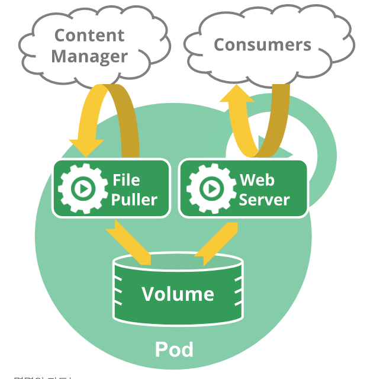
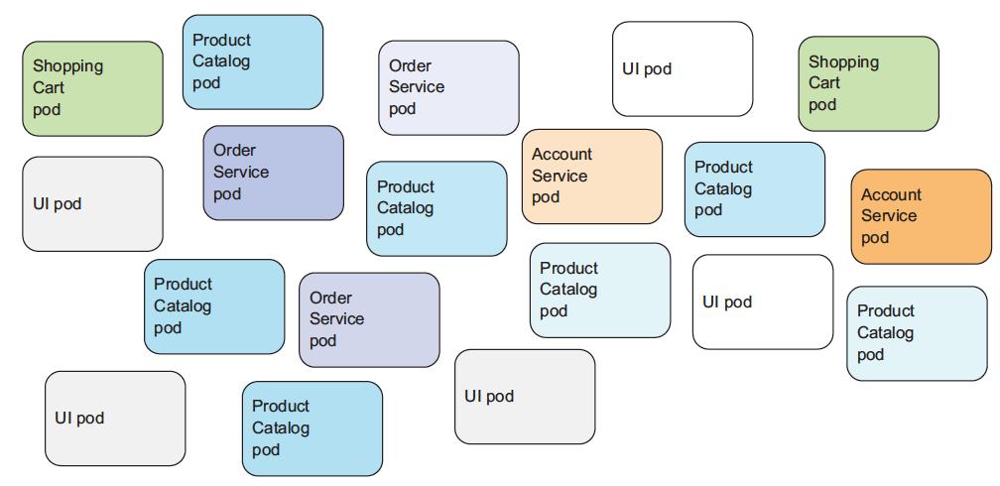
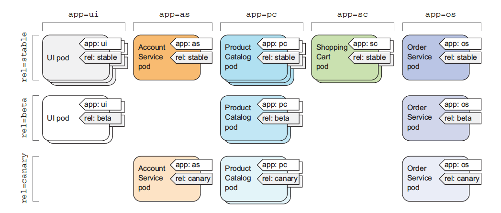
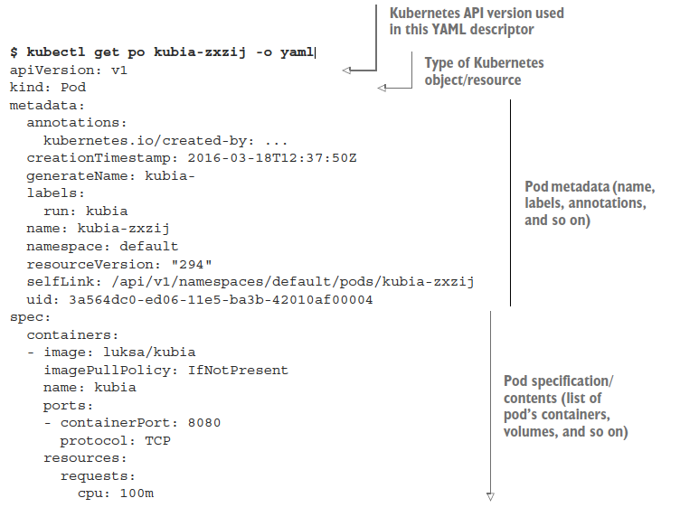
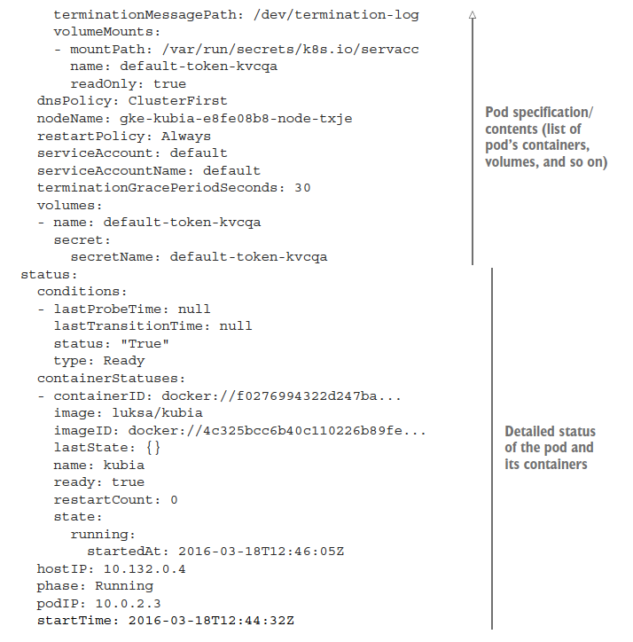
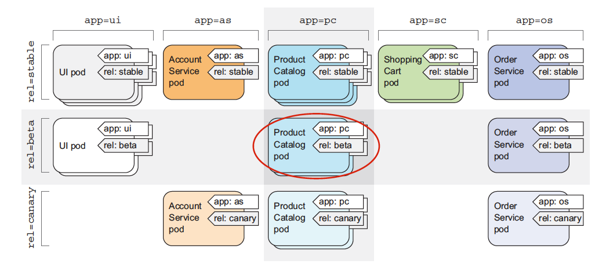

# 1. Pod

## 1.1 Pod 개요
파드는 쿠버네티스의 기본 구성 요소이다. 쿠버네티스 객체 모델 중 만들고 배포할 수 있는 가장 작고 간단한 단위이다. 파드는 쿠버네티스 클러스터에서 Running 프로세스를 나타낸다.

파드는 애플리케이션 컨테이너, 저장소 리소스, 특정 네트워크 IP 그리고,소프트웨어와 그것에 종속된 모든 것을 포함한 light-weight portable한 배포의 단위를 말한다.

도커는 쿠버네티스 파드에서 사용되는 가장 대표적인 컨테이너 런타임이지만, rkt이나 CRI-O등도 지원한다. 

쿠버네티스 클러스터 내부의 파드는 주로 두 가지 방법으로 사용된다.

 - 단일 컨테이너만 동작하는 파드. “단일 컨테이너 당 한 개의 파드” 모델은 쿠버네티스 사용 사례 중 가장 흔하다. 이 경우, 한 개의 파드가 단일 컨테이너를 감싸고 있다고 생각할 수 있으며, 쿠버네티스는 컨테이너가 아닌 파드를 직접 관리한다고 볼 수 있다.
 - 함께 동작하는 작업이 필요한 다중 컨테이너가 동작하는 파드. 아마 파드는 강하게 결합되어 있고 리소스 공유가 필요한 다중으로 함께 배치된 컨테이너로 구성되어 있을 것이다. 이렇게 함께 배치되어 설치된 컨테이너는 단일 결합 서비스 단위일 것이다. 한 컨테이너는 공유 볼륨에서 퍼블릭으로 파일들을 옮기고, 동시에 분리되어 있는 “사이드카” 컨테이너는 그 파일들을 업데이트 하거나 복구한다. 파드는 이 컨테이너와 저장소 리소스들을 한 개의 관리 가능한 요소로 묶는다.

 

 ## 1.2 Pod -  네트워킹

각각의 파드는 유일한 IP주소를 할당 받는다. 한 파드 내부의 모든 컨테이너는 네트워크 네임스페이스와 IP주소 및 네트워크 포트를 공유한다. *파드 안에 있는* 컨테이너는 다른 컨테이너와 `localhost`를 통해서 통신할 수 있다. 

## 1.3 Pod - 저장소

파드는 공유 저장소 집합인 Volume을 명시할 수 있다. 파드 내부의 모든 컨테이너는 공유 볼륨에 접근할 수 있고, 그 컨테이너끼리 데이터를 공유하는 것을 허용한다. 또한 볼륨은 컨테이너가 재시작되어야 하는 상황에도 파드 안의 데이터가 영구적으로 유지될 수 있게 한다. 


## 1.4 파드와 컨트롤러

컨트롤러는 파드를 생성하고 관리해 주는데, 클러스터 범위 내에서의 레플리케이션 핸들링, 롤아웃 그리고 셀프힐링 기능 제공을 한다. 예를 들어, 만약 노드가 고장났을 때, 컨트롤러는 다른 노드에 파드를 스케줄링 함으로써 자동으로 교체할 것이다.  

한 가지 또는 그 이상의 파드를 보유한 컨트롤러의 몇 가지 예시.

* [디플로이먼트](/docs/concepts/workloads/controllers/deployment/)
* [스테이트풀 셋](/docs/concepts/workloads/controllers/statefulset/)
* [데몬 셋](/docs/concepts/workloads/controllers/daemonset/)

세 가지 유형의 컨트롤러를 사용할 수 있다.

- 배치 연산과 같이, 종료가 예상되는 파드를 위해서는 `Job`컨트롤러를
  사용하길 바란다. 잡은 `restartPolicy`가 실패 시(OnFailure) 또는 절대 안 함(Never)으로
  지정된 경우에 적합하다.

- 웹 서버와 같이, 종료가 예상되지 않는 파드에 대해서는 `Replication Controller`, `ReplicatSet`, `Deployment` 컨트롤러를 사용하기 바란다. 
  레플리케이션 컨트롤러는 `restartPolicy`가 항상(Always)으로 지정된
  경우에만 적합하다.

- 머신 당 하나씩 실행해야하는 파드를 위해서는 `DamonSet`을 사용하길
  바란다. 왜냐하면 데몬 셋은 특정 머신 전용 시스템 서비스(machine-specific system service)를 제공하기 때문이다.

세 가지 모든 컨트롤러 유형은 PodTemplate을 가지고 있다. 파드를
직접적으로 생성하는 것 보다는, 적절한 컨트롤러를 생성하고 컨트롤러가 파드를
생성하도록 하는 것이 추천된다. 그 이유는 파드
혼자서는 머신의 실패에 탄력적(resilient)이지 않지만, 컨트롤러는 탄력적이기 때문이다.


## 1.5 파드 템플릿
파드 템플릿은 다양한 컨트롤러(Replication Controller, Jobs, DaemonSets)내에 기술되는 Pod의 사양(Specification)이다. 컨트롤러는 이런 파드 템플릿을 이용해 실제 파드를 생성한다. 

아래 예시는 메시지를 출력하는 컨테이너를 포함하는 파드에 대한 간단한 매니페스트이다.

```yaml
apiVersion: v1
kind: Pod
metadata:
  name: myapp-pod
  labels:
    app: myapp
spec:
  containers:
  - name: myapp-container
    image: busybox
    command: ['sh', '-c', 'echo Hello Kubernetes! && sleep 3600']
```


### 1.5.1 Cookie Cutter (쿠키 툴)
파드 템플릿을 마치 쿠키를 만들 때 사용하는 쿠키 툴과 같다. 예를 들어 Replication Controller로 Replicat를 3개 만든 이후에, Template을 변경하면, 이미 만들어진 파드에는 영향이 미치지 않고 (마치 이미 만든 쿠기 모양은 그대로 지켜지는 것과 같은) 새롭게 만들어지는 파드에만 변경 사항이 적용되게 된다.


## 1.6 파드 라이프사이클

### 1.6.1 파드의 단계(phase)

파드의 `status` 필드는
`phase` 필드를 포함하는
[PodStatus](https://kubernetes.io/docs/reference/generated/kubernetes-api/v1.15/#podstatus-v1-core) 오브젝트로 정의된다.

파드의 phase는 파드가 라이프사이클 중 어느 단계에 해당하는지 표현하다. 


`phase`에 가능한 값은 다음과 같다.

값 | 의미
:-----|:-----------
`Pending` | 파드가 쿠버네티스 시스템에 의해서 승인되었지만, 파드를 위한 하나 또는 하나 이상의 컨테이너 이미지 생성이 아직 완료되지 않았다. 여기에는 스케줄되기 이전까지의 시간 뿐만 아니라 오래 걸릴 수 있는 네트워크를 통한 이미지 다운로드 시간도 포함된다.
`Running` | 파드가 한 노드에 결합되었고, 모든 컨테이너들의 생성이 완료되었다. 적어도 하나의 컨테이너가 동작 중이거나, 시작 또는 재시작 중에 있다.
`Succeeded` | 파드에 있는 모든 컨테이너들이 성공으로 종료되었고, 재시작되지 않을 것이다.
`Failed` | 파드에 있는 모든 컨테이너들이 종료되었고, 적어도 하나 이상의 컨테이너가 실패로 종료되었다. 즉, 해당 컨테이너는 non-zero 상태로 빠져나왔거나(exited) 시스템에 의해서 종료(terminated)되었다.
`Unknown` | 어떤 이유에 의해서 파드의 상태를 얻을 수 없다. 일반적으로 파드 호스트와의 통신 오류에 의해서 발생한다.


### 1.6.2 컨테이너 프로브(probe)

프로브는 컨테이너에서 kubelet에 의해 주기적으로 수행되는 진단(diagnostic)이다.
진단을 수행하기 위해서,
kubelet은 컨테이너에 의해서 구현된
[핸들러](https://godoc.org/k8s.io/kubernetes/pkg/api/v1#Handler)를 호출한다.
핸들러에는 다음과 같이 세 가지 타입이 있다.

* `ExecAction`은 컨테이너 내에서 지정된 명령어를 실행한다.
  명령어가 상태 코드 0으로 종료되면 진단이 성공한 것으로 간주한다.

* `TCPSocketAction`은 지정된 포트에서 컨테이너의 IP주소에 대해 TCP 검사를 수행한다.
  포트가 활성화되어 있다면 진단이 성공한 것으로 간주한다.

* `HTTPGetAction`은 지정한 포트 및 경로에서 컨테이너의 IP주소에
  대한 HTTP Get 요청을 수행한다. 응답의 상태 코드가 200보다 크고 400보다 작으면
  진단이 성공한 것으로 간주한다.

각 probe는 다음 세 가지 결과 중 하나를 가진다.

* Success: 컨테이너가 진단을 통과함.
* Failure: 컨테이너가 진단에 실패함.
* Unknown: 진단 자체가 실패하였으므로 아무런 액션도 수행되면 안됨.

kubelet은 실행 중인 컨테이너들에 대해서 선택적으로 두 가지 종류의 프로브를 수행하고 그에 반응할 수 있다.

* `livenessProbe`는 컨테이너가 동작 중인지 여부를 나타낸다. 만약
   활성 프로브(liveness probe)에 실패한다면, kubelet은 컨테이너를 죽이고, 해당 컨테이너는
   [재시작 정책](#재시작-정책)의 대상이 된다. 만약 컨테이너가
   활성 프로브를 제공하지 않는 경우, 기본 상태는 `Success`이다.

* `readinessProbe`는 컨테이너가 요청을 처리할 준비가 되었는지 여부를 나타낸다.
   만약 준비성 프로브(readiness probe)가 실패한다면, 엔드포인트 컨트롤러는
   파드에 연관된 모든 서비스들의 엔드포인트에서 파드의 IP주소를 제거한다. 준비성 프로브의
   초기 지연 이전의 기본 상태는 `Failure`이다. 만약 컨테이너가 준비성 프로브를
   지원하지 않는다면, 기본 상태는 `Success`이다.

### livenessProbe 예제

활성 프로브는 kubelet에 의해서 실행된다. 따라서 모든 요청은
kubelet 네트워크 네임스페이스에서 이루어진다.

```yaml
apiVersion: v1
kind: Pod
metadata:
  labels:
    test: liveness
  name: liveness-http
spec:
  containers:
  - args:
    - /server
    image: k8s.gcr.io/liveness
    livenessProbe:
      httpGet:
        # "host"가 정의되지 않은 경우, "PodIP" 가 사용될 것이다.
        # host: my-host
        # "scheme"이 정의되지 않은 경우, "HTTP" 스키마가 사용될 것이다. "HTTP"와 "HTTPS"만 허용된다.
        # scheme: HTTPS
        path: /healthz
        port: 8080
        httpHeaders:
        - name: X-Custom-Header
          value: Awesome
      initialDelaySeconds: 15
      timeoutSeconds: 1
    name: liveness
```

### 1.6.3 파드 및 컨테이너 상태

#### 1.6.3.1 컨테이너 상태

일단 스케줄러가 파드를 노드에 할당하면, kubelet이 컨테이너 런타임으로 컨테이너를 만들기 시작한다. 컨테이너에 세 가지 상태가 있는데, Waiting, Running, 그리고 Terminated이다. 컨테이너의 상태를 체크하려면 `kubectl describe pod [POD_NAME]` 명령을 사용할 수 있다. 상태는 파드 안에 있는 컨테이너 각각에 대해 출력된다.

* `Waiting`: 컨테이너의 기본 상태이다. 컨테이너가 Running 이나 Terminated 상태가 아닌 경우, Waiting 상태이다. Waiting 상태의 컨테이너는 이미지를 내려받거나(pull), 시크릿을 적용하는 등의 필요한 오퍼레이션이 수행 중인 상태이다. 이 상태와 더불어서, 더 자세한 정보를 제공하기 위해 상태에 대한 메시지와 이유가 출력된다.

    ```yaml
   ...
      State:          Waiting
       Reason:       ErrImagePull
	  ...
   ```

* `Running`: 컨테이너가 이슈 없이 구동된다는 뜻이다. 컨테이너가 Running 상태가 되면, `postStart` 훅이 (존재한다면) 실행된다. 이 상태는 컨테이너가 언제 Running 상태에 돌입한 시간도 함께 출력된다.

   ```yaml
   ...
      State:          Running
       Started:      Wed, 30 Jan 2019 16:46:38 +0530
   ...
   ```

* `Terminated`:  컨테이너가 실행이 완료되어 구동을 멈추었다는 뜻이다. 컨테이너가 성공적으로 작업을 완료했을 때나 어떤 이유에서 실패했을 때 이 상태가 된다. 원인과 종료 코드(exit code)가 컨테이너의 시작과 종료 시간과 함께 무조건 출력된다.
  컨테이너가 Terminated 상태가 되기 전에, `preStop` 훅이 (존재한다면) 실행된다.

   ```yaml
   ...
      State:          Terminated
        Reason:       Completed
        Exit Code:    0
        Started:      Wed, 30 Jan 2019 11:45:26 +0530
        Finished:     Wed, 30 Jan 2019 11:45:26 +0530
    ...
   ```

#### 1.6.3.2 재시작 정책

PodSpec은 항상(Always), 실패 시(OnFailure), 절대 안 함(Never) 값으로 설정 가능한 `restartPolicy` 필드를 가지고 있다.
기본 값은 항상(Always)이다.
`restartPolicy`는 파드 내의 모든 컨테이너들에 적용된다. `restartPolicy`는
같은 노드에 있는 kubelet에 의한 컨테이너들의 재시작에만 관련되어 있다.
kubelet에 의해서 재시작되는 종료된 컨테이너는 10초, 20초, 40초... 순으로 배수로 증가하면서 5분까지 재시작을 시도한다. 

### 1.6.4 Label을 이용한 Pod 구조화

마이크로서비스 기반의 운영환경에서는 아래 그림처럼 굉장히 많은 Pod가 배포되게 된다. 


이런 환경에서 Label을 이용해서 Pod를 그룹화할 수 있다. 

#### 1.6.4.1 라벨 소개
라벨은 포드만이 아니라 쿠버네티스 모든 리소스를 그룹화하는 간단하지만 강력한 기능이다. 라벨은 리소스에 첨부하는 `key/value`쌍이다. 

예를 들어 시스템을 `app`(application종류) `rel`(release)라는 두개의 라벨을 이용해서 다음과 같이 구조화 할수 있다.




### 1.6.5 Namespace를 이용한 Resource Grouping

네임스페이스는 복수의 팀이나, 프로젝트에 걸쳐서 많은 사용자가 있는 환경에서 사용하도록 만들어졌다. 사용자가 거의 없거나, 수 십명 정도가 되는 경우에는, 네임스페이스를 고려할 필요가 전혀 없다. 네임스페이스가 제공하는 기능이 필요할 때 사용하도록 하자.

네임스페이스는 이름의 범위를 제공한다. 리소스의 이름은 네임스페이스 내에서 유일해야하지만, 네임스페이스를 통틀어서 유일할 필요는 없다.

네임스페이스는 클러스터 자원을 (리소스 쿼터를 통해) 복수의 사용자 사이에서 나누는 방법이다.

## 1.7 Pod 실습

### 1.7.1. Pod를 설명하는 YAML Descriptor와 친해지기

앞 세션에서 Deploy했던 Pod를 찾아서 Pod의 속성을 yaml 파일 형태로 요청한다. 

```bash
$ kubeclt get po
# 여기서 찾아진 Pod 이름을 활용
$ kubectl get po kubia-zxzij -o yaml
```




> 천천히  Pod의 각 속성들에 친해지는 시간을 갖는다. pod를 만들때는 기술하지 않았던 Default값이 모두 설정되어 있는것을 볼 수 있다. 

제일 위에는 API 버전과 Object와 종류가 나온다. 
```yaml
apiVersion: v1
kind: Pod
```

- Pod Metadata(name, labels, annotations)
```yaml
metadata:
  annotations:
    kubernetes.io/created-by: ...
  creationTimestamp: 2016-03-18T12:37:50Z
  generateName: kubialabels:
    run: kubia
  name: kubia-zxzij
  namespace: default
  resourceVersion: "294"
  selfLink: /api/v1/namespaces/default/pods/kubia-zxzij
  uid: 3a564dc0-ed06-11e5-ba3b-42010af00004
```
  - Pod Specification(Pod의 Container 리스트, Volume등) 
  )
```yaml
spec:
  containers:
  - image: luksa/kubia
    imagePullPolicy: IfNotPresent
    name: kubia
    ports:
  - containerPort: 8080
      protocol: TCP
    resources:
      requests:
        cpu: 100m
        terminationMessagePath: /dev/termination-log
        volumeMounts:
        - mountPath: /var/run/secrets/k8s.io/servacc
          name: default-token-kvcqa
          readOnly: true
        dnsPolicy: ClusterFirst
        nodeName: gke-kubia-e8fe08b8-node-txje
        restartPolicy: Always
        serviceAccount: default
        serviceAccountName: default
        terminationGracePeriodSeconds: 30
        volumes:
          - name: default-token-kvcqa
            secret:
              secretName: default-token-kvcqa
```
- Pod와 내부 컨테이너의 생태정보
```yaml
status:
  conditions:
  - lastProbeTime: null
    lastTransitionTime: null
    status: "True"
    type: Ready
  containerStatuses:
  - containerID: docker://f0276994322d247ba...
    image: luksa/kubia
    imageID: docker://4c325bcc6b40c110226b89fe...
    lastState: {}
    name: kubia
    ready: true
    restartCount: 0
    state:
      running:
       startedAt: 2016-03-18T12:46:05Z
  hostIP: 10.132.0.4
  phase: Running
  podIP: 10.0.2.3
  startTime: 2016-03-18T12:44:32Z
```

### 1.7.2 첫번째 Pod yaml 생성

아래 내용을 kubia-manual.yaml로 저장한다.
>yaml은 indentation(들여쓰기)에 주의해야 한다.  
```yaml
apiVersion: v1
kind: Pod
metadata:
  name: kubia-manual
spec:
  containers:
  - image: luksa/kubia
    name: kubia
    ports:
    - containerPort: 8080
      protocol: TCP
```
  - kubectl -f로 yaml 적용하기

```shell
$ kubectl create -f kubia-manual.yaml
pod "kubia-manual" created
```

 - 생성한 pod의 전체 definition 조회
```shell
# yaml 양식으로 출력
$ kubectl get po kubia-manual -o yaml   
# json 형식으로 출력
$ kubectl get po kubia-manual -o json  
```

### 1.7.3 Application log 보기

`docker`에서는 logs 서브 명령을 이용해 /dev/STDOUT과 /dev/STDERR로 전달되는 application의 log를 조회할 수 있다.
```shell
$ docker logs <container id>
```

k8s의 kubectl도 비슷한 방법으로 pod의 log를 조회할 수 있다.   

```shell
$ kubectl logs kubia-manual
Kubia server starting...
```
현재는 접속을 안해서 로그가 없을 것이다. 

> 참조 : 컨테이너 log는 Daily로 rotate되며 log 파일의 크기가 10MB에 도달해도 rotate된다. 따라서 kubectl logs 커멘드로는 이전에 rotate이후의 내용만 조회 가능하다.  

### 1.7.4 Port forward를 이용한 Pod 접속

아래와 같이 `port-forward` 명령을 이용 local machine에서 pod로 port forwarding을 통해 직접 접속이 가능하다. 

```shell
$ kubectl port-forward kubia-manual 8888:8080
... Forwarding from 127.0.0.1:8888 -> 8080
... Forwarding from [::1]:8888 -> 8080

```
 - 접속 확인
```shell
$ curl localhost:8888
You’ve hit kubia-manual
```

## 1.7.5 포드를 만들 때 라벨 지정하기

아래와 같이 2개의 Label을 추가해서 파드를 생성한다. 
`creation_method=manaul` `env=prod`를 추가시켰다.

```yaml
#kubia-manual-with-label.yaml
apiVersion: v1
kind: Pod
metadata:
  name: kubia-manual-v2
  labels:
    creation_method: manual
    env: prod
spec:
  containers:
  - image: luksa/kubia
    name: kubia
    ports:
    - containerPort: 8080
      protocol: TCP
```

 -  Label을 추가한 파드를 생성한다.
```shell
$ kubectl create -f kubia-manual-with-labels.yaml
pod "kubia-manual-v2" created
```

 - --show-labels로 생성된 파드의 라벨 조회
```shell
#creat_method=manual,env=prod 확인
$ kubectl get po --show-labels
NAME        READY    STATUS     RESTARTS     AGE     LABELS
kubia-manual 1/1     Running    0             16m     <none>
kubia-manual-v2 1/1  Running    0             2m      creat_method=manual,env=prod
kubia-zxzij   1/1    Running    0             1d      run=kubia
```

 - -L 스위치를 이용해 라벨 지정한 조회
```shell
$ kubectl get po -L creation_method,env
NAME        READY     STATUS    RESTARTS  AGE   CREATION_METHOD   ENV
kubia-manual 1/1      Running     0       16m     <none>        <none>
kubia-manual-v2 1/1   Running     0       2m      manual          prod
kubia-zxzij 1/1       Running     0       1d      <none>          <none>
```
 - 라벨 수정 & 조회
> 라벨 변경엔 --overwrite 옵션을 이용해야 한다.
```shell
#pod의 env라벨의 값을 prod -> debug
$ kubectl label po kubia-manual-v2 env=debug --overwrite
pod "kubia-manual-v2" labeled


$ kubectl get po -L creation_method,env
NAME          READY   STATUS  RESTARTS  AGE   CREATION_METHOD   ENV
kubia-manual  1/1     Running   0       16m     manual          <none>
kubia-manual-v2 1/1   Running   0       2m      manual          debug
kubia-zxzij 1/1       Running   0       1d      <none>          <none>
```

### 1.7.6 label selector를 이용한 subset 나열


```shell
$ kubectl get po -l creation_method=manual
NAME              READY   STATUS  RESTARTS  AGE
kubia-manual      1/1     Running 0         51m
kubia-manual-v2   1/1     Running 0         37m
```
이 Label selector기능을 이용하는 특정 pod만 변경을 적용하는 것이 가능 



### 1.7.7 Label과 Selector를 이용해서 포드 스케줄링 조절하기

예를 들어 Machine Learning을 실행하는 Pod는 GPU가 있는 노드에 배정하고 싶은경우 이 라벨과 셀렉터를 이용하면 가능하다. 

우선 임의의 노드에 `gpu=true` 라벨을 추가한다. 


```shell
$ kubectl get node  #여기서 나온 Node Name을 아래에 예제에서 사용한다. 
....

$ kubectl label node gke-kubia-85f6-node-0rrx gpu=true
node "gke-kubia-85f6-node-0rrx" labeled

#노드의 label 확인
$ kubectl get nodes -l gpu=true
NAME                      STATUS  AGE
gke-kubia-85f6-node-0rrx  Ready   1d
```

 - 특정 노드에 포드 스케줄링
밑에 yaml 처럼 `nodeSelector`에 `gpu=true`라벨 추가
```yaml
#kubia-gpu.yaml
apiVersion: v1
kind: Pod
metadata:
  name: kubia-gpu
spec:
  nodeSelector:
    gpu: "true"
  containers:
  - image: luksa/kubia
    name: kubia

```

```shell
#포드 생성
$ kubctl creat -f kubia-gpu.yaml
#포드 확인
$ kubectl get pod
```


### 1.7.8 namespace 실습

- namespace와 그 namespace에 속한 pod 조회

일반적으로 `kubectl get po`를 하면 `default` namespace의 pod를 반환한다. 
```shell
$ kubectl  get ns
NAME LABELS STATUS AGE
default <none> Active 1h
kube-public <none> Active 1h
kube-system <none> Active 1h

```

```shell
# namespace를 특정하면 그에 속한 포드를 조회할 수 있다. 다음은 시스템 포드를 조회한 결과 이다.
$ kubectl get po --namespace kube-system
NAME                               READY  STATUS  RESTARTS AGE
fluentd-cloud-kubia-e8fe-node-txje 1/1    Running   0      1h
heapster-v11-fz1ge                 1/1    Running   0      1h
kube-dns-v9-p8a4t                  0/4    Pending   0      1h
kube-ui-v4-kdlai                   1/1    Running   0      1h
l7-lb-controller-v0.5.2-bue96      2/2    Running   92      1h
```
위의 예는 system pod라는 kube-system namespace에 속한 pod들이다. 

### 1.7.9 Pod의 Stop & Delete
 - 포드 삭제 방법
```shell
$ kubectl delete po kubia-gpu
pod "kubia-gpu" deleted
```
포드를 삭제하면 포드내의 모든 컨테이너가를 종료하도록 쿠버네티스가 지시를 하게 된다. 쿠버네티스는 프로세스에 `SIGTERM`신호를 보내고 정상적으로 종료되도록 일정 시간(default 30초)을 대기한다. 이 시간내에 종료되지 않으면 `SIGKILL`을 통해 강제 종료된다. 

 #### 1.7.10 라벨 셀렉터를 사용한 포드 삭제

라벨 셀렉터를 사용하면 여러 포드를 한꺼번에 삭제할 수 있다. 
 ```shell
 $ kubectl delete po -l creation_method=manual
pod "kubia-manual" deleted
pod "kubia-manual-v2" deleted
 ```

## Chapter 2 Contents
 - ### [0. Concept](0-concept.md)
 - ### [1. POD](1-pod.md)
 - ### [2. Controller](2-controller.md)
 - ### [3. Service](3-service.md)
 - ### [4. Volume](4.volume.md)


### Reference
 - Kubernetes in Action