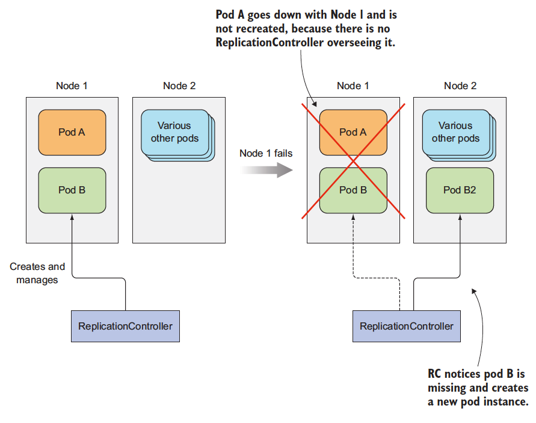
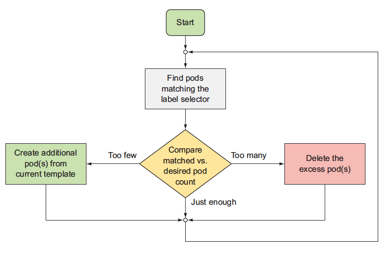
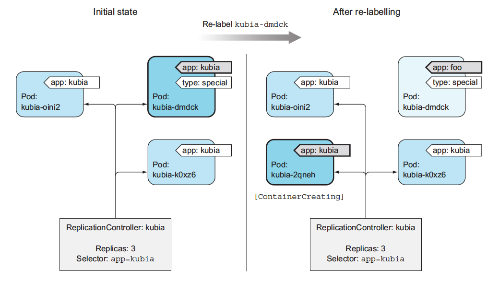
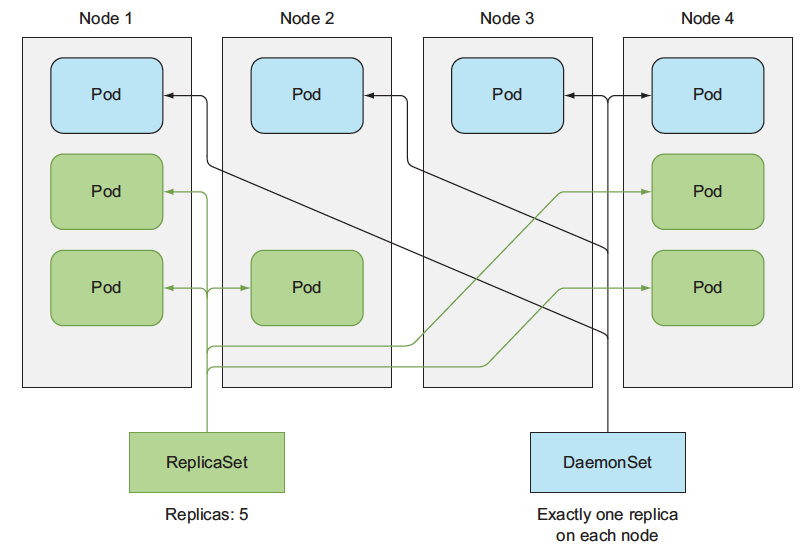
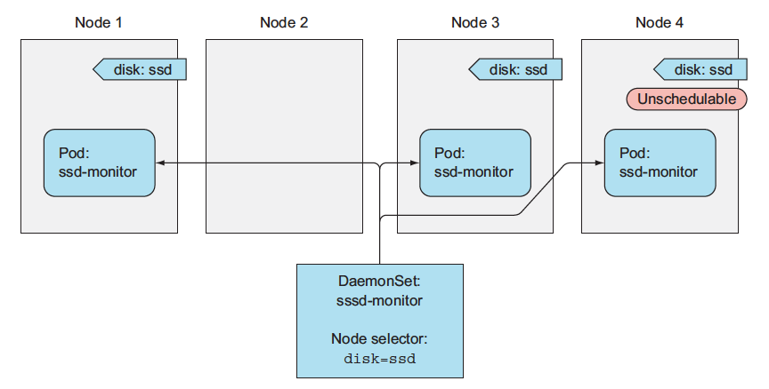
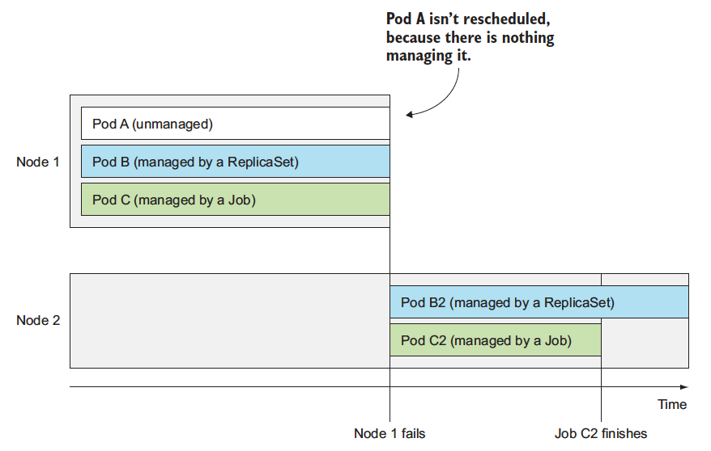

# Controller


 - Replication Controller
 - ReplicaSet Controller
 - DaemonSet Controller
 - Job Controller
 - CronJob Controller


앞에서 살펴 본 봐와 같이 Pod는 가능한 가장 작은 단위이다. 그러나 수동으로 만들어진 Pod의 경우 장애에 대해 취약하다. 
이 절에서 실습해 볼 Controller는 이런 이상상황에서도 Pod의 재기동등 관리할 수 있는 쿠버네티스의 리소스이다. 

## 1. Replication Controller

Replication Controller는 포드가 항상 실행되도록 유지하는 쿠버네티스 리소스로, 여떤 이유에서든(노드 장애)) 포드가 삭제된 것을 감지하고 대체 포드를 생성한다. 




Pod A는 수동으로 만든, 관리가 되지 않는 포드의 경우, 노드 장애등에 취약한 반면, RC로 관리되는 포드의 경우 다른 노드에서 포드를 새로 생성한다. 


### 1.1 Controller's Reconciliation loop (조정)



RC는 Label Selector와 일치하는 포드 숫자와(desired) 현재 실행(current)를 비교해서, 포드 숫자를 조절한다. 

### 1.2 Replication Controller의 이용하는 이점
 - 포드가 없는 경우 새 포드를 시작해 포드가 항상 실행되도록 한다. 
 - 클러스터 노드에 장애가 발생하면 장애가 발생한 노드에서 실행 중인 모든 포드의 대체 복제보을 만든다. 
 - 쉽게 scaling이 가능하다. 


### 1.3 RC 실습
RC를 생성해서 포드를 관리하는 방법에 대해서 실습한다. 

#### 1.3.1 Replication Controller 생성

아래의 yaml을 쿠버네티스 API서버에 게시하면, 쿠버네티스가 RC를 생성한다.  `spec.selector`의 정의 되어 있는 바와 같이 라벨이 app=kubia인 pod를 3개(`spec.replicas=3`)가 되게 유지 한다. 


```yaml
apiVersion: v1
kind: ReplicationController
metadata:
  name: kubia
spec:
  replicas: 3
  selector:
    app: kubia
  template:
    metadata:
      labels:
        app: kubia
    spec:
      containers:
      - name: kubia
        image: luksa/kubia
        ports:
        - containerPort: 8080
```

>여기서 주의 사항은 template의 label과 selector의 label이 같아야 한다는 것이다. 그렇지 않으면 rc가 pod의 label이 app=kubia인 pod를 3개가 될때 까지 계속적으로 pod를 만들어 낼 것이다. 


``` shell
$ kubectl create -f kubia-rc.yaml
```

#### 1.3.2 Replication Controller 실행확인

app=kubia 라는 라벨을 가진 포드가 없기 때문에 rc 가 포드 템플릿에 기술된 대로 포드를 실행시킨다. 

``` bash
$ kubectl get pods
NAME READY STATUS RESTARTS AGE
kubia-53thy 0/1 ContainerCreating 0 2s
kubia-k0xz6 0/1 ContainerCreating 0 2s
kubia-q3vkg 0/1 ContainerCreating 0 2s
```

그중 포드 하나를 삭재해서 rc가 어떻게 동작하는제 확인한다.

```bash
# 포드 삭제
$ kubectl delete pod kubia-53thy
pod "kubia-53thy" deleted

# 포드 상태 확인
$ kubectl get pods
NAME READY STATUS RESTARTS AGE
kubia-53thy 1/1 Terminating 0 3m
kubia-oini2 0/1 ContainerCreating 0 2s
kubia-k0xz6 1/1 Running 0 3m
kubia-q3vkg 1/1 Running 0 3m
```
포드가 하나는 `Terminating` 되고 하나는 새로 `ContainerCreating` -> `Running`이 되는것 확인할 수 있다.   
(변경 사항을 확인하기 위해서는 위의 명령을 여러번 실행하거나 `--watch` 스위치를 사용할 수 있다. )


```bash
#RC확인
$ kubectl get rc
NAME DESIRED CURRENT READY AGE
kubia   3       3       2   3m

# RC 자세한 정보 확인
$ kubectl describe rc kubia
Name: kubia
Namespace: default
Selector: app=kubia
Labels: app=kubia
Annotations: <none>
Replicas: 3 current / 3 desired
Pods Status: 4 Running / 0 Waiting / 0 Succeeded / 0 Failed
Pod Template:
    Labels: app=kubia
    Containers: ...
Events:
From                  Type    Reason           Message
----                  ------- ------           -------
replication-controller Normal SuccessfulCreate Created pod: kubia-53thy
replication-controller Normal SuccessfulCreate Created pod: kubia-k0xz6
replication-controller Normal SuccessfulCreate Created pod: kubia-q3vkg
replication-controller Normal SuccessfulCreate Created pod: kubia-oini2
```
여기서 Pods Status: `4` Running 으로 되어 있는데, 이는 terminating도 실행으로 간주하기 때무이다. 

이 과정을 그림으로 나타내면 다음과 같다


#### 1.3.3 Node 장애

이건 확인이 필요하다. 


#### 1.3.3. Pod의 Label 변경
포드의 라벨을 변경해서 rc의 라벨 셀렉터와 일치하지 않게 되면 포드는 다른 수동으로 만든 포드 처럼 관리하지 않는 포드가 된다. 

이 실습에서는 라벨을 변경해서 rc와의 관계를 끊는 방법을 배운다. 



```bash
#관리되는 포드에 라벨을 추가한다. (kubectl get po로 이미 생성한 포드의 이름중 하나 사용)
$ kubectl label pod kubia-dmdck type=special
pod "kubia-dmdck" labeled

#라벨 추가 확인 type=special
$ kubectl get pods --show-labels
NAME READY STATUS RESTARTS AGE LABELS
kubia-oini2 1/1 Running 0 11m app=kubia
kubia-k0xz6 1/1 Running 0 11m app=kubia
kubia-dmdck 1/1 Running 0 1m app=kubia,type=special

# --overwrite 스위치를 이용해서 라벨 변경
$ kubectl label pod kubia-dmdck app=foo --overwrite
pod "kubia-dmdck" labeled

# -L app 옵션을 사용해 포드 상황 확인 
$ kubectl get pods -L app
NAME READY STATUS RESTARTS AGE APP
kubia-2qneh 0/1 ContainerCreating 0 2s kubia
kubia-oini2 1/1 Running 0 20m kubia
kubia-k0xz6 1/1 Running 0 20m kubia
kubia-dmdck 1/1 Running 0 10m foo

```

> 위의 방법은 장애 상황에서 디버깅에 유용하게 사용된다. 장애가 발생한 pod를 위의 방법과 같이 라벨을 변경해서 rc가 새로운 포드를 생성해서 서비스를 안전하게 교체하도록하고, 장애가 있는 pod를 디버깅하도록 유지한다. 


#### 1.3.4 Pod Template

포드 템플릿은 흔히 Cookie-Cutter(빵틀)에 비유된다. rc를 이용해 포드를 만들어 낼때 이 템플릿이 마치 붕어빵 틀 처럼 `똑같이 생긴`파드를 찍어 내기 때문이다. 그런데 중간에 템플릿을 변경하면 어떻게 될까?

아래 그림 처럼 이미 만들어 놓은 빵(Pod)의 모양에는 영향을 주지는 않지만 새롭게 만드는 빵(Pod)의 모양은 변경되게 되지만 총합은 정의된 replicas수 만큼을 보증하게 된다.  


#### 1.3.5 포드 스케일링
replicas의 수를 늘려서 실행할 포드의 수를 확장할 수 있다.

```bash
# scale을 이용해서 변경
$ kubectl scale rc kubia --replicas=10

# edit를 vi editor로 이용해서 직접 변경
$ kubectl edit rc kubia

# Please edit the object below. Lines beginning with a '#' will be ignored,
# and an empty file will abort the edit. If an error occurs while saving
# this file will be reopened with the relevant failures.
apiVersion: v1
kind: ReplicationController

metadata:
    ...
spec:
    replicas: 3
    selector:
        app: kubia
...

```

```bash
#변경 사항 확인
$ kubectl get rc
NAME DESIRED CURRENT READY AGE
kubia 10        10      4  21m

# pod수 확인
$ kubectl get pod

# scale down
$ kubectl scale rc kubia --replicas=3

```

## 2. ReplicaSet Controller

초기의 쿠버네티스에서는 pod의 복제본을 관리하는 컨트롤러가 Replication Controller가 유일했지만, 다양한 요구사항이 증가하면서 RC를 대체할 용도로 ReplicaSet Controller가 만들어졌다. 

차이점은 
 - 1. Deployment를 생성하면 자동으로 rs(ReplicaSet)가 생성된다는 것과 
 - 2. 좀더 풍부한 표현식(matchLabels, Match Expression) 기반이다. 

 예를 들면 RC는 포드의 라벨을 env=production과 env=develop을 동시만 일치시킬 수 없었다. 그러나 rs는 아래와 같은 조건식을 이용해서 label selector를 풍부하게 만들었다. 

``` yaml
selector:
    matchExpressions:
        - key: env
            operator: In
            values:
                - prodcution
                - develop

```
 연산자. 
  - In:라벨의 값이 지정되 값 중 하나와 일치해야 한다. 
  - NotIn : 라벨의 값이 지정된 값과 일치해서는 안된다.
  - Exists : 포드에는 지정된 키가 있는 라벨이 있어야 한다. (키의 값은 일치하지 않아되 된다.key가 exist한지)
  - DoesNotExists : 포드내에 지정된 키가 있는 라벨이 있으면 안된다. 


### 2.1 ReplicaSet Controller 실습


```bash
# rs 생성
$ kubectl create -f kubia-replicatset-matchexpressions.yaml

# rs 확인
$ kubectl get rs
NAME DESIRED CURRENT READY AGE
kubia 3 3 3 3s

# rs 정보 확인
$ kubectl describe rs
Name: kubia
Namespace: default
Selector: app=kubia
Labels: app=kubia
Annotations: <none>
Replicas: 3 current / 3 desired
Pods Status: 3 Running / 0 Waiting / 0 Succeeded / 0 Failed
Pod Template:
    Labels: app=kubia

Containers: ...
Volumes: <none>
Events: <none>

# rs 삭제
$ kubectl delete rs kubia
replicaset "kubia" deleted

```

## 3. DaemonSet

DaemonSet은 각 노드에 하나만 생성되는 Pod로, 보통 시스템 수준의 작업을 수행하는 인프라성 포드들이다. 
예를 들어 로그 수집기나 리소스 모니터링과 같은 기능을 하는 경우로, 쿠버네티스에서는 kube-proxy가 데몬셋으로 구성되어 있다. 



쿠버네티스를 사용하지 않는 환경에서는 일반적으로 노드 부팅중에 init스크립트나, systemd데몬이 이런 프로세스이다. 쿠버네티스 노드 환경에서도 systemd를 사용해 시스템 프로세스를 실행할 수 있지만 쿠버네티스가 제공하는 모든 기능을 이용할 수는 없다. 
참고로 kubelet은 systemd 서비스이다. 

데몬셋에 의해 만들어지는 모드는 스케줄러의 스케줄링 대상이 아니며, kubelet이 관리한다. 


### 3.1 DaemonSet 실습
아래 그림 처럼 ssd가 있는 노드에만 DaemonSet의 배포되도록 node에 label(disk:ssd)을 추가하고 daemset을 생성한다.



```yaml
# daemonset yaml 확인 app:ssd-monitor
apiVersion: apps/v1beta2
kind: DaemonSet
metadata:
  name: ssd-monitor
spec:
  selector:
    matchLabels:
      app: ssd-monitor
  template:
    metadata:
      labels:
        app: ssd-monitor
    spec:
      nodeSelector:
        disk: ssd
      containers:
      - name: main
        image: luksa/ssd-monitor
```

```bash
# ds생성
$ kubectl create -f ssd-monitor-daemonset.yaml
daemonset "ssd-monitor" created

# ds확인
$ kubectl get ds
NAME        DESIRED CURRENT READY UP-TO-DATE AVAILABLE NODE-SELECTOR
ssd-monitor  0         0     0         0       0        disk=ssd

# po 확인
$ kubectl get po
No resources found.
```

disk=ssd 인 라벨을 가지고 있는 노드가 없어서 Pod가 생성되지 않았다. Node에 라벨을 추가해 보

```bash
#node 이름 확인
$ kubectl get node
NAME                   STATUS   ROLES    AGE   VERSION
k8s-master-ol-setup    Ready    master   82d   v1.12.7+1.1.2.el7
k8s-worker1-ol-setup   Ready    <none>   82d   v1.12.7+1.1.2.el7
k8s-worker2-ol-setup   Ready    <none>   82d   v1.12.7+1.1.2.el7
k8s-worker3-ol-setup   Ready    <none>   82d   v1.12.7+1.1.2.el7
k8s-worker4-ol-setup   Ready    <none>   82d   v1.12.7+1.1.2.el7

# node에 label 추가
$ kubectl label node k8s-worker1-ol-setup disk=ssd

# pod확인
$ kubectl get po
NAME            READY STATUS RESTARTS AGE
ssd-monitor-hgxwq 1/1 Running   0     35s

```

## 4. Job, Cron Job

잡 컨트롤러는 계속해서 실행되어야하는 성격이 아니라 실행되고나서 종료되어야하는 성격의 작업을 실행시킬때 사용하는 컨트롤러 이다. 잡은 특정 개수 만큼의 포드가 성공적으로 완료되는걸 보장해 준다.    
가장 간단한 경우로는 잡이 포드 하나를 실행하고 포드가 정상적으로 종료됐는지 확인하는 것이다. 실행한 포드가 실패하거나 하드웨어 장애가 발생하거나 노드가 재부팅 되는등 문제가 발생하면 다시 포드를 실행한다. 잡 하나가 포드를 여러개 실행하는 것도 가능합니다.




```yaml
apiVersion: batch/v1
kind: Job
metadata:
  name: batch-job
spec:
  template:
    metadata:
      labels:
        app: batch-job
    spec:
      restartPolicy: OnFailure
      containers:
      - name: main
        image: luksa/batch-job

```
Pod의 spec.restartPolicy의 기본값은 `Always`로 job의 경우 무제한 실행하지 않으므로 Always대신에 `OnFailure` 또는 `Never`로 설정해야 한다.    

### CronJob
크론잡은 잡을 시간 기준으로 관리하는 한다. 지정된 시간에 한번만 잡을 실행하거나 주기적으로 지정된 시간동안 반복하면서 잡을 실행합니다. 시간을 지정하는 형식은 리눅스나 유닉스에서 많이 사용하는 크론 형식으로 지정한다.  
크론잡은 지정된 시간에 잡을 실행하는데 정확하게 한번에 하나의 잡만을 실행하는게 아니라, 2개의 잡이 실행될수도 있고 잡이 실행되지 않을수도 있다. startingDeadlineSeconds 옵션을 크게 설정하거나 아니면 따로 설정하지 않고 concurrencyPolicy 옵션을 Allow로 두면 잡은 최소한 한번(at least once)은 실행한다. 크론잡은 잡을 생성하는 역할만 하고 잡이 실행되고 나면 일반 잡과 마찬가지로 작동한다.


### 4.1 Job 실습

아래와 같이 sleep 120 초 하는 컨테이너를 하나 띄우는 job을 대상으로 실습한다. 
```dockerfile
FROM busybox
ENTRYPOINT echo "$(date) Batch job starting"; sleep 120; echo "$(date) Finished succesfully"
```


```bash
#job 생성
$ kubectl create -f batch-job.yaml

#job 조회
$ kubectl get jobs
NAME DESIRED SUCCESSFUL AGE
batch-job 1 0 2s

# 실행이 끝난 포드도 보여주도록 조회(--show-all, -a)
$ kubectl get po --show-all
NAME READY STATUS RESTARTS AGE
batch-job-28qf4 0/1 Completed 0 2m

# log 확인
$ kubectl logs batch-job-28qf4
Fri Apr 29 09:58:22 UTC 2016 Batch job starting
Fri Apr 29 10:00:22 UTC 2016 Finished succesfully
```


#### Reference
 - Kubernetes in Action
 - [아리수](https://arisu1000.tistory.com/27837)


### Step 1. Pod YAML Description 살펴보기 

$ kubectl get pod <pod-name> -o yaml
page 62


### Step 2. YAML 파일 생성하기

각 영역 설명 추가 

### Step 3 explain을 이용한 pod 정보 보기 

$ kubectl explain pod.spec


### Step 4. Portforwd
$ kubectl port-forward kubia-manual 8888:8080


## Pods Label 

## NameSpace

## Stopping and Removing pod